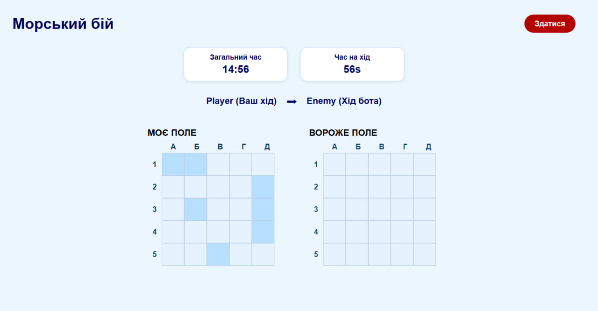

# Battleship Game

A web-based implementation of the classic Battleship strategy game.

The game allows a player to compete against an AI opponent with multiple difficulty levels. It includes persistent game state, timers, and a results history system.

---

## Game Preview



---

## Table of Contents

- [About the Game](#about-the-game)
- [Game Rules](#game-rules)
- [Features](#features)
- [Project Structure](#project-structure)
- [Getting Started](#getting-started)
- [Available Scripts](#available-scripts)
- [Configuration](#configuration)
- [Documentation](#documentation)
- [Privacy Policy](#privacy-policy)
- [License](#license)
- [Author](#author)

---

## About the Game

Battleship is a turn-based strategy game for two players.  
In this implementation, a human player competes against an AI opponent.

The objective is to sink all enemy ships before the opponent sinks yours.

---

## Game Rules

- The game is played on a 5x5 grid.
- Each player places ships on their grid.
- Ships cannot overlap or touch (including diagonally).
- Players take turns firing shots.
- The first player to sink all enemy ships wins.

---

## Features

- Manual and automatic ship placement
- AI difficulty modes:
    - Random
    - Target
    - Smart
- Turn timer
- Persistent game state (localStorage)
- Results history page
- Dynamic routing with userId
- Modular architecture with Redux Toolkit

---

## Project Structure (in progress)
```
src/
├── components/ # Reusable UI components
├── pages/ # Route-level components
├── routes/ # Application routing
├── store/ # Redux Toolkit state management
├── utils/ # Core game and AI logic
├── constants/ # Game configuration constants
├── hook/ # Custom React hooks
├── assets/ # Static assets
│
├── App.jsx # Root application 
└── main.jsx # Application entry point
```
---
## Architecture Overview

The project follows a modular and scalable architecture:

- **UI Layer** – React components and pages
- **State Management Layer** – Redux Toolkit slices
- **Domain Logic Layer** – Game mechanics and AI logic (utils)
- **Persistence Layer** – LocalStorage integration

This separation ensures maintainability, readability, and extensibility of the codebase.

---

## Getting Started

### Prerequisites

- Node.js v18+
- npm v9+

### Installation

```bash
git clone https://github.com/sofia-maidaniuk/kop_battleship.git
cd kop_battleship
npm install
```

### Running in Development Mode
```bash
npm run dev
```

### Available Scripts
```bash
npm run dev       # start development server
npm run build     # production build
npm run preview   # preview production build
npm run lint      # run ESLint
```

---

## Configuration

### Vite (`vite.config.js`)

The project uses Vite as the bundler and development server.

It provides:
- Fast Hot Module Replacement (HMR)
- ES module-based development
- Optimized production builds

---

### ESLint (`eslint.config.js`)

ESLint is configured to maintain code quality and consistency.

Applied rule sets include:
- `@eslint/js` – base recommended rules
- `eslint-plugin-react-hooks` – validation of React hooks usage
- Vite compatibility rules

The `dist/` directory is excluded from linting.

---

### State Management (Redux Toolkit)

Redux Toolkit is configured in: [src/store/](https://github.com/sofia-maidaniuk/kop_battleship/tree/main/src/store)

It includes:
- `store.jsx` – store configuration
- `gameSlice.jsx` – game state logic
- `settingsSlice.jsx` – game configuration settings

---

### Routing (React Router)

Application routing is defined in: [src/routes/AppRouter.jsx](https://github.com/sofia-maidaniuk/kop_battleship/blob/main/src/routes/AppRouter.jsx)


---

## Documentation (in progress)

Technical documentation and project materials are included in this repository.

🎥 Documentation video:  
*(Link will be added here)*


---

## Privacy Policy (in progress)

The Privacy Policy document will be available in:

---

## License

This project is distributed under the MIT License.

All third-party dependencies were checked using `license-checker`.

Licensing details are provided in the [LICENSE](./LICENSE) file.

A full dependency license report is available in [LICENSE_REPORT.md](./license-check-report)


## Author
Sofia Maidaniuk  
